# Ukui Control Center
## Overview
Ukui Control Center provides a friendly graphic interface to set the system. As shown in Fig 1.

 

## System
### Display
As shown in Fig 2.

- monitor：Select current monitor.

- resolution, orientation, refresh rate, screen zoom are all for the current active monitor.

- screen zoom to global zoom.

- night mode has the functions of adjusting color temperature and customizing the night mode time period.

### Touchscreen
As shown in Fig 3.

- monitor: Select the screen that you want to map to.

- device: The name of the chosen touchscreen.

### Defaultapp
As shown in Fig 4, browser, mail, image viewer, audio player, video player, text editor can be changed.

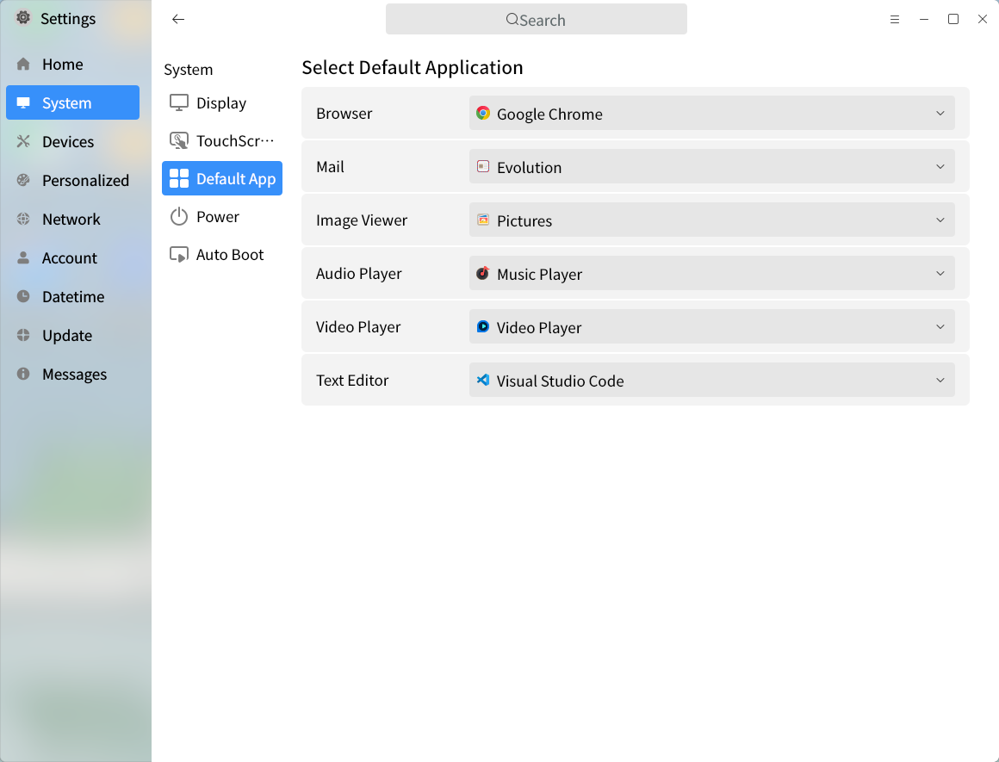

### Power
- Provide "Balance", "Saving", "Performance" modes.

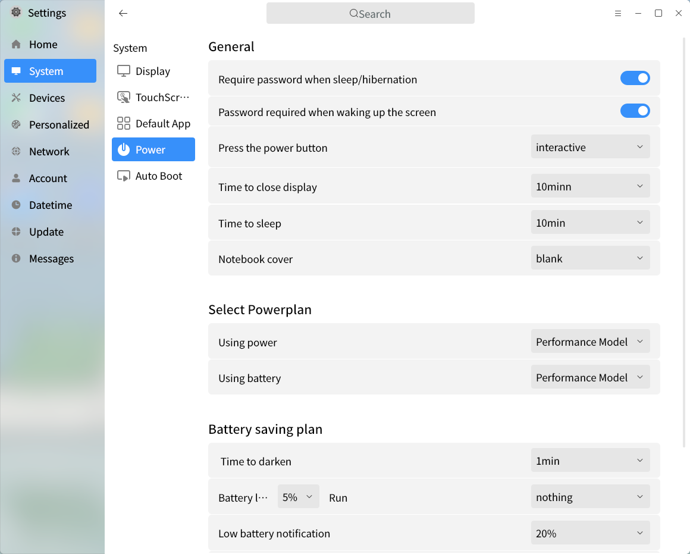

### Auto Boot
List shows the existed autoboot applications.

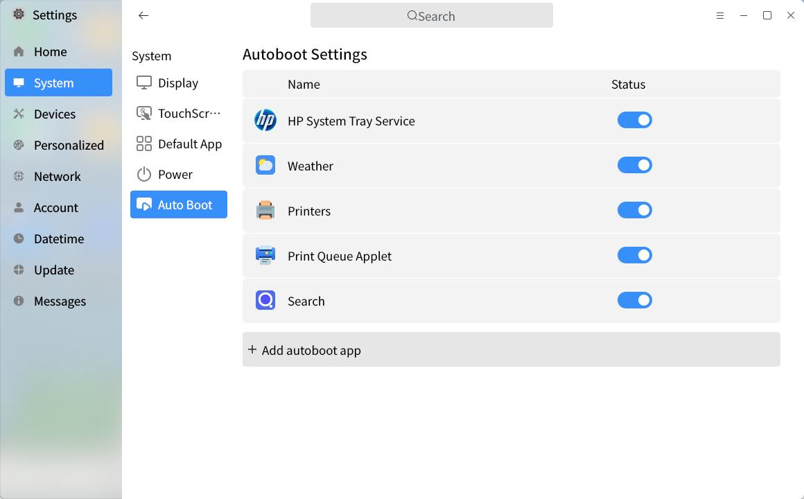

Click "+" can add apps.

 

## Devices
### Printer
Provide an entry to add printers or scanners. 

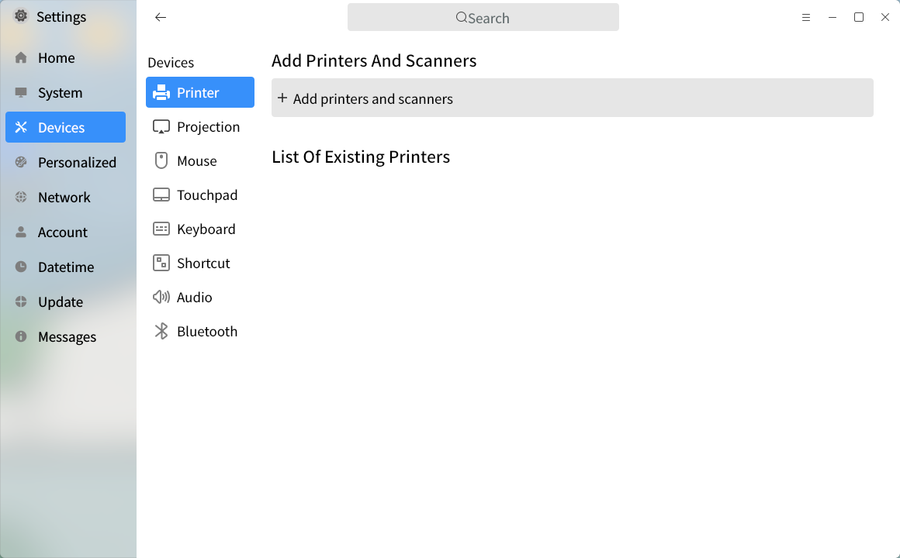

### Mouse
Customize the mouse key, pointer settings, and cursor settings.

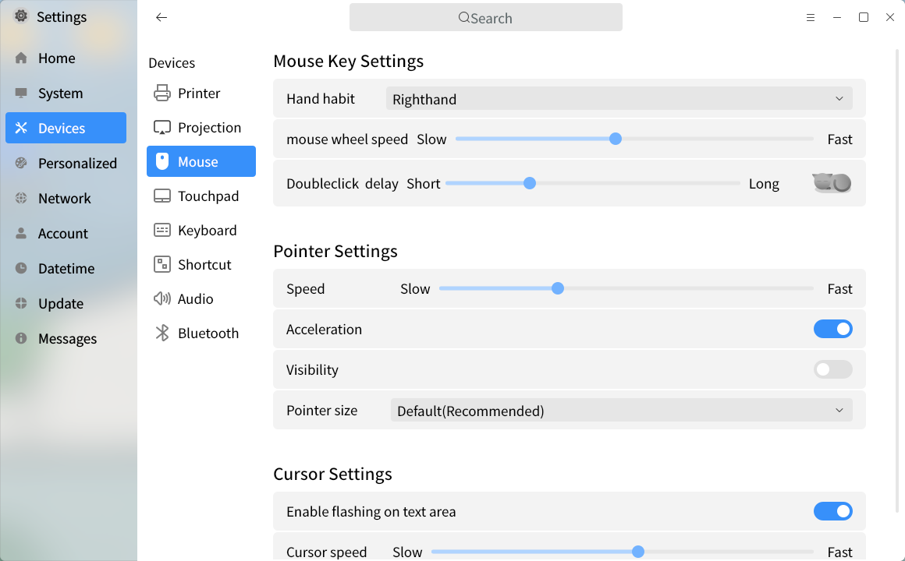

### Touchpad
Touchpad provides the settings as shown in Fig 10.

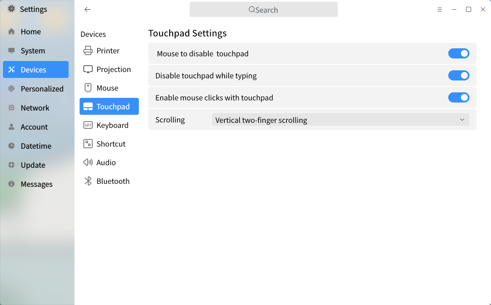

### Keyboard
Set the keyboard's general items, and adjust the layout by the language.

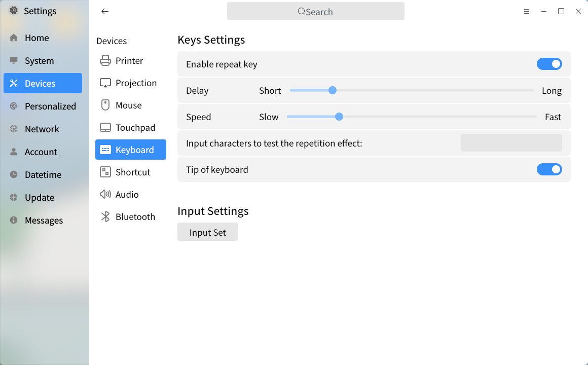

- Enable repeat key: Long press one button will be recognized to repeat input.

- Delay: The time between press button and receive input.

- Speed: The time between repeat input.

- Layout: Up to 4 layouts can be added.

### Shortcut
View all the system shortcuts and customize shortcut.

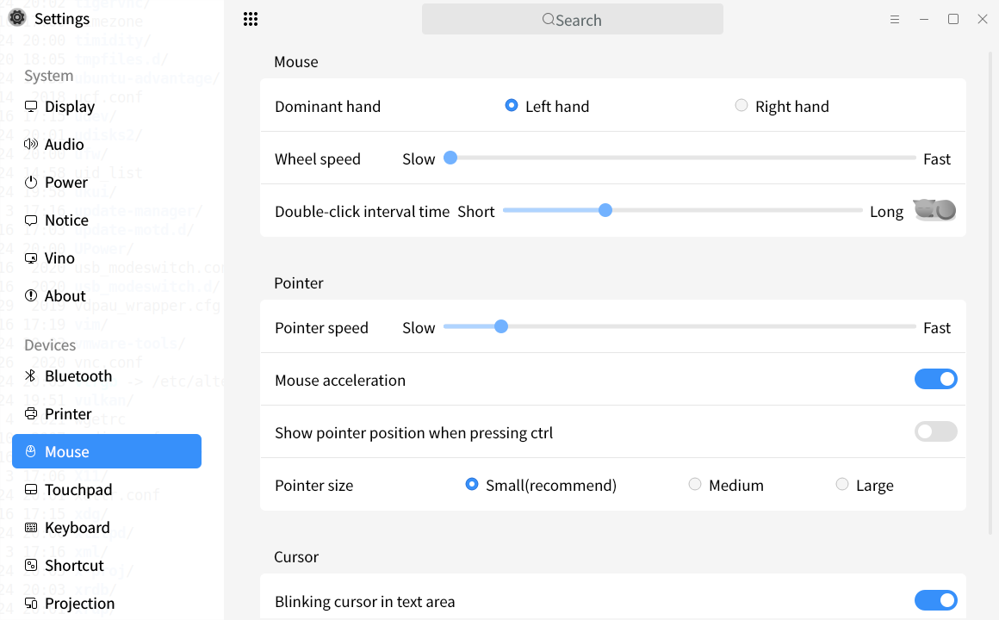

Tips: System shortcuts are not allowed to be modified.

Click "Add custom shortcut" and the popup as shown in Fig 13.

### Audio
Settings for output, input and system sound, as shown in Fig 14.

### Bluetooth
Provide the functions like those: open the bluetooth, rename the device, show/hide the icon of the bluetooth, find the nearby devices, etc.. As shown in Fig 15.

 

## Personalized
### Background
Here are "picture" and "color" can be selected.

### Theme
- Theme Mode:

- Icon theme and cursor theme:

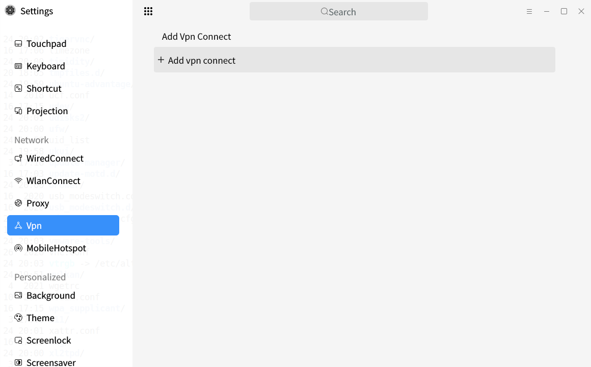

- Effect settings (some machines do not support this function):

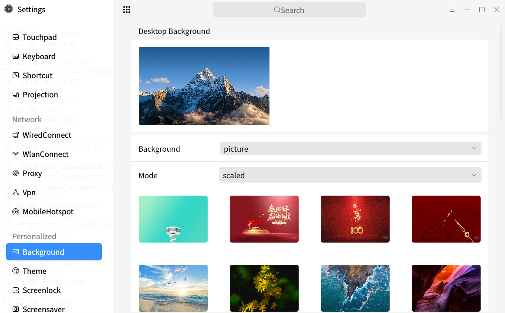

### Screenlock
Select the background image that shows in login interface.

### Fonts
Settings for font, size, mono font.

Click "Reset to default" to restore the settings to default status.

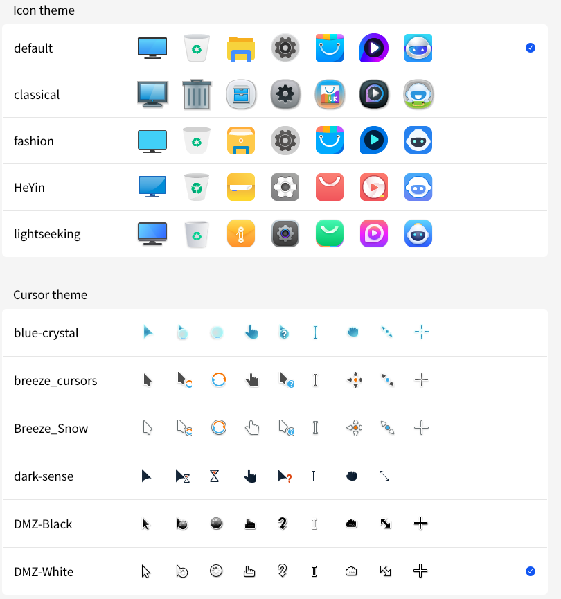

### Screensaver
Set the screensaver program and idle time.

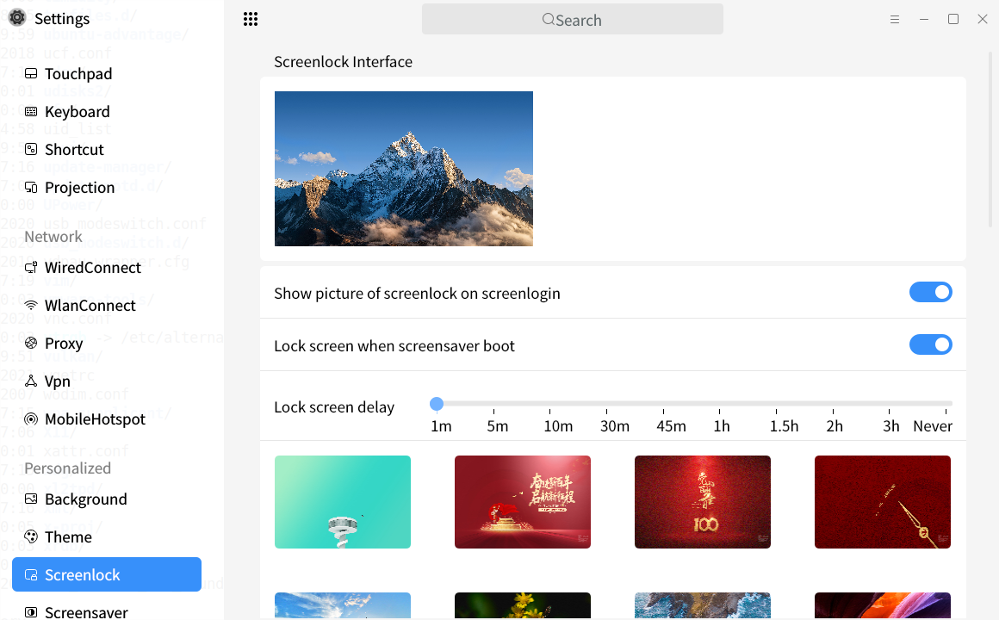

### Desktop
Set the icons lock on Start Menu and Tray Menu.

 

## Network
It includes "Connect", "Vpn", "Proxy", and "Vino".

### Connect
Show the available network, netconnect status

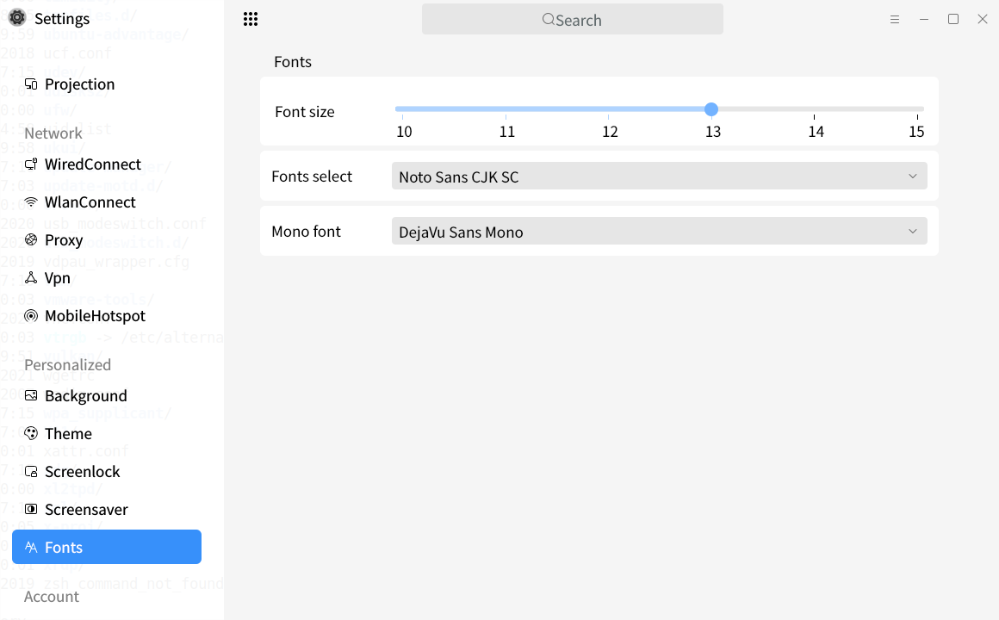

### Vpn
Open the settings of VPN.

### Proxy
Auto proxy, manual proxy (including HTTP, HTTPS, FTP, SOCKS).

### Vino
Users can set that confirm when conect or enter specified password after checking "Allow others to view your desktop".

 

## Account
Manage all the system users, create/delete users, and modify users' informations.

### User Info

- Change User Face: Click user's face can change it.

- Change Password: Click "Password" to modify the current user's password.

- Change Account Type: administrator -- can elevated permission temporarily; standard user -- can't elevated permission.

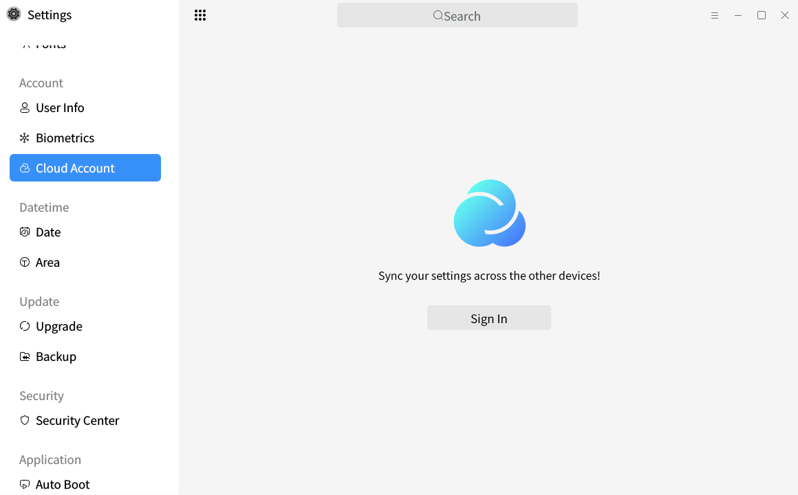

#### Other Users
Administrator can modify other user's information, add new user, etc..

- Add new user

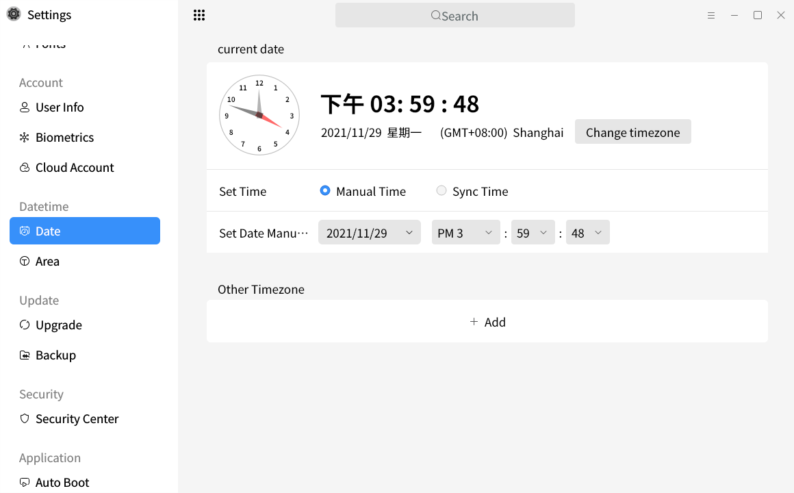

- Edit

### Cloud Account
Synchronize personalized settings and data, and this function needs to sign in.

#### Sign In
Login through Kylin ID login Center.

#### Synchronizable Items
- Desktop wallpaper

- Screensaver: wallpaper and idle time

- Fonts

- User's face

- The settings in control center, such as start menu, taskbar, theme, etc.

- The settings of pluma, kylin weather, peony, terminal, kylin video.

#### Tips
1) When opening the cloud account first time, it will synchronize once by default. If the cloud exists configuration files, it will download them and sync to local; Otherwise, the local configuration files will be uploaded to the cloud.

2) After login, if the automatic synchronization is opened, the cloud will synchronize the local configurations every 5 minutes. And they can be used by different machines, different users.

3) If the automatic synchronization is closed, all the cloud configurations will keep the last upload status.

4) The automatic synchronization for the single item is the similar effects.

 

## Datetime

It includes "Date" and "Area".

### Date

As shown in Fig 37:

- Sync from network: Sync the time on the Internet NTP server.

- Change time zone:

### Area

- first language: Language in system windows, menus and website. 

- Click "Add main language" to add others.

 

## Update

It includes "Security Center", "Backup" and "Upgrade".

### Security Center
An access of security center.

### Backup
- Begin backup: Back up files to other devices.

- Begin restore: View backup list and restore the system to one of them.

### Upgrade
Check whether the system has available updates.

- Update: Show the current update status and the time of the latest refresh.

- Update List: Push system available updates.

- Update Settings: Whether allow to renewable notice and backup before updating.

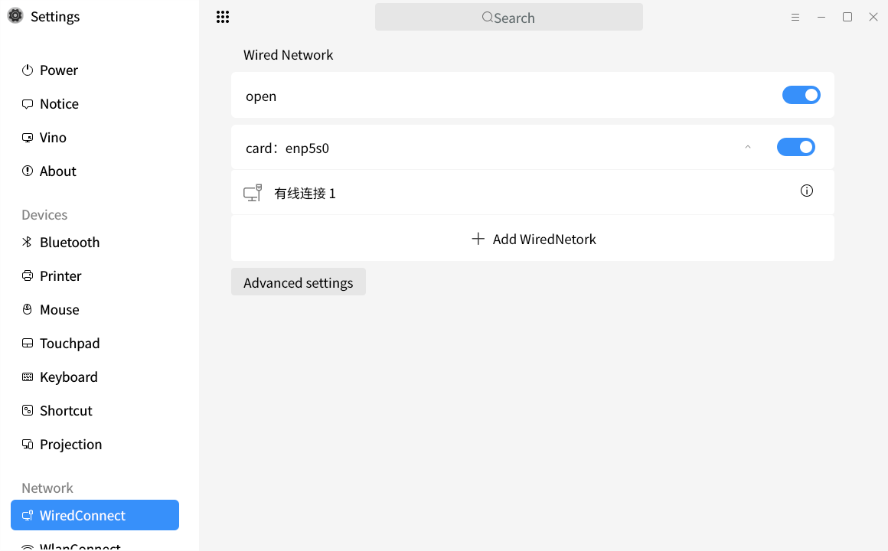 

### Background update

Background update is mainly used for important update operations in the background, and to remind users of available update content.

- When there is an important update, the update will be silently in the background, and the user will receive the notification information before and after the upgrade.

  

  

  

- When there are available updates, the selection interface will pop up for users to select.

  

  

  

- After the user selects immediate update, the Settings > update interface will pop up to check the update

- When the user chooses to delay, the record sets the delay time and exits the background update program.

## Messages

It includes "Notice", "Search", and "AboutConnect".

### Notice
As shown in Fig 38.

### Search

As shown in Fig 39.

### About

Show the system version, authentication, etc..

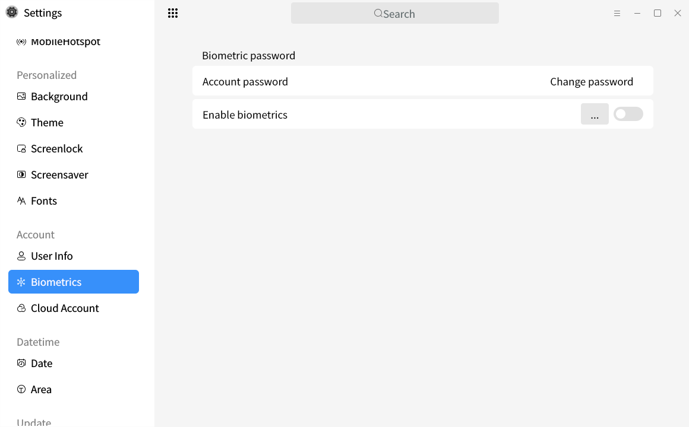